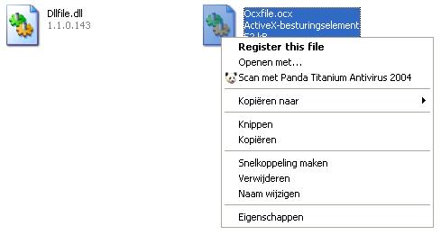



## Auto Register

### Description

When you run these small lines of code your register will be edited in such way, that you'll be able to register any new dll and ocx files by just double clicking on them!
 
### More Info
 

             |
---                |---
**Submitted On**   |2004-08-22 05:37:02
**By**             |[Sjoerd](https://github.com/Planet-Source-Code/PSCIndex/blob/master/ByAuthor/sjoerd.md)
**Level**          |Beginner
**User Rating**    |5.0 (20 globes from 4 users)
**Compatibility**  |VB 5\.0, VB 6\.0, VB Script
**Category**       |[Registry](https://github.com/Planet-Source-Code/PSCIndex/blob/master/ByCategory/registry__1-36.md)
**World**          |[Visual Basic](https://github.com/Planet-Source-Code/PSCIndex/blob/master/ByWorld/visual-basic.md)
**Archive File**   |[Auto\_Regis1784578222004\.zip](https://github.com/Planet-Source-Code/sjoerd-auto-register__1-55741/archive/master.zip)

